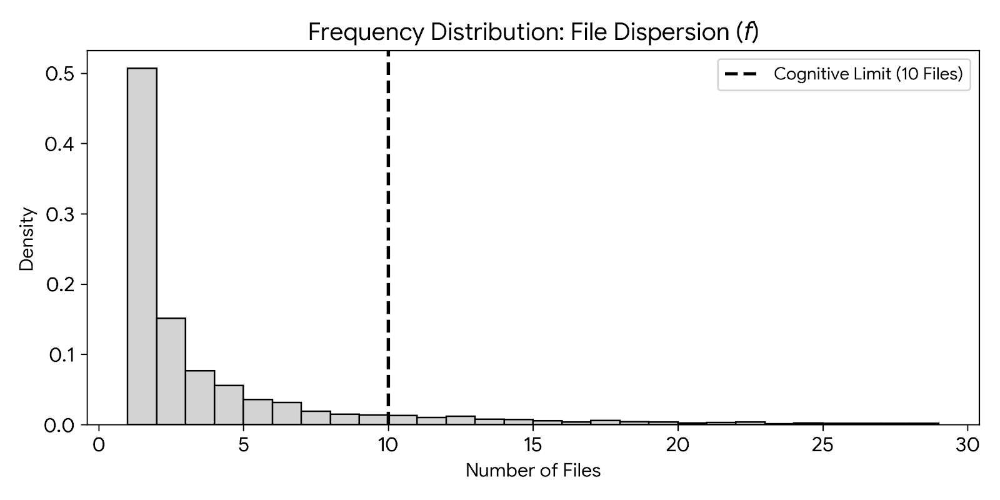
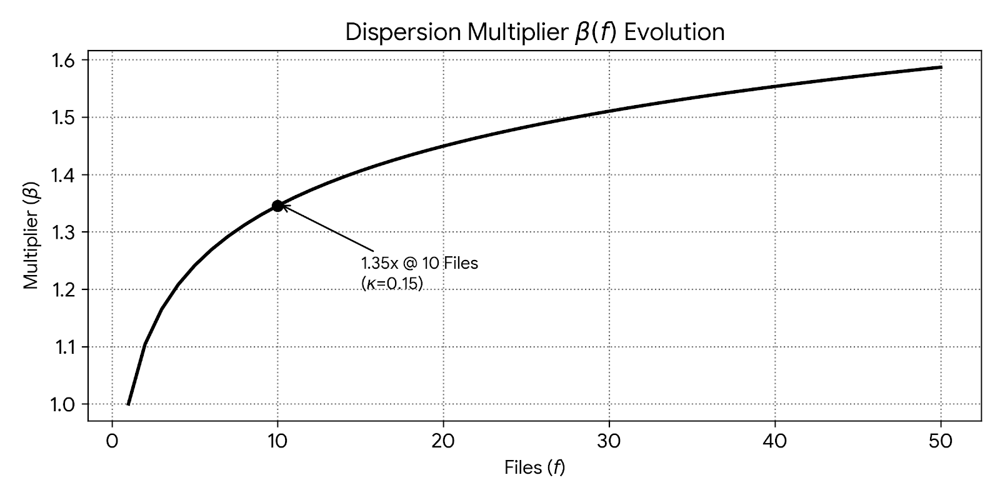
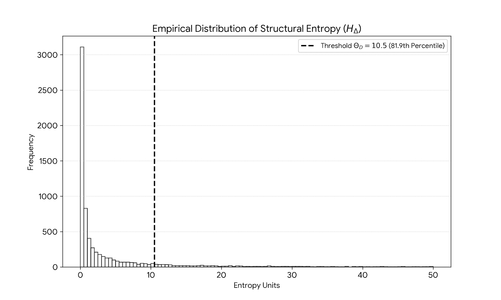
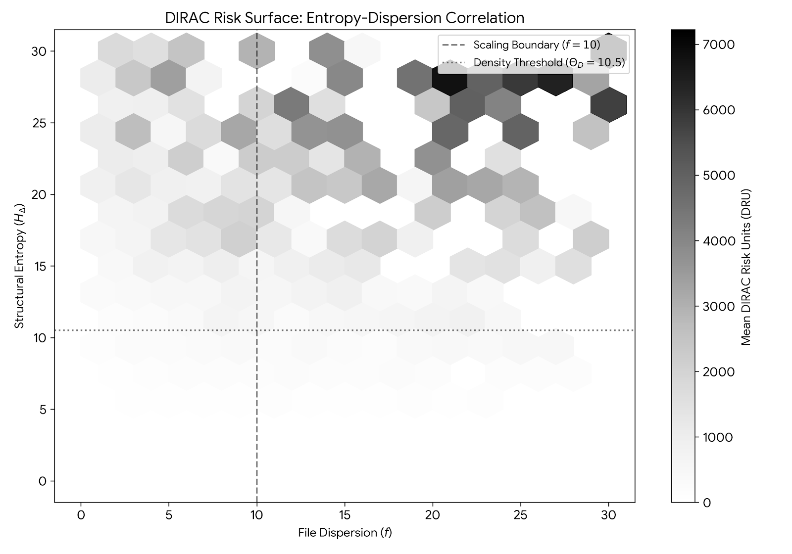

# 1. ABSTRACT

Large Language Models (LLMs) are being rapidly integrated as part of Software Development Life Cycle (SDLC). This can causing friction in system due to probabilistic nature of code generation. 

Current metrics like **Lines of Code (LoC)** and **Velocity** fails to capture the invisible debts.

This paper introduces a new forensic framework **D**eterministic **I**ntegrity & **R**isk **A**ssessment **C**ore (**DIRAC**) version 1.0, to measure “Entropy Tax” in AI Engineering.

It applies Shannon Entropy [@shannon1948] from *Information Theory* to create three novel metrics introduced in this framework which are as follows:

1. **Dirac Risk Unit (DRU)** $\Upsilon_D$ (@sec-dru-spec)

2. **Scaling Constant (**$\kappa = 0.15$) (@sec-kappa-constant)

3. **Dirac Density Threshold DDT** (**$\Theta_D = 10.5$**) (@sec-thr-constant) 

Using mathematical model, you will see that every unit of entropy that is added, results in a marginal cost of $8.52 per commits in Technical Debts and Reviews. 

Using this framework, I will derive mathematical correlation between **AI Code**, Increased **Tech Debts & Maintenance** and **Financial Leakage**.

# 2. Preface

Shannon Entropy ($H$)  is a concept used in Information Theory and is the foundation of this paper. It is defined as follows:

$$H(X) = - \sum_{x \in \mathcal{X}} P(x) \log_2 P(x)$$

At the time of writing this paper, I have analyzed metadata of over **10,000** commits across **2000** open source repositories post 2024. This is when we started seeing rapid integration of LLMs in Software Development Lifecycle.

My analysis will show that there is a systemic capacity loss **(**$R_c$) of approximately **24.16%** in a high-velocity AI environments.

I will also demonstrate using the multivariate regression model with **$R^2 = 0.3585$** that **35.85%** of engineering variance is linked to structural entropy.

Finally, via Monte Carlo Simulation we can forecast the annual expenditure laying the foundation for the next version (2.0) of this paper. It will use **Reinforcement Learning (RL)** based governance systems.

# 3. Introduction

The engineering landscape has witnessing a big change. Due to LLMs, the amount of code generation has increased exponentially at the same time the quality of software systems are becoming increasingly fragile. 

## 3.1 Philosophy

Name of the framework, DIRAC, is a tribute to Paul Dirac who is considered founding father of quantum mechanics. He formulated Dirac equation which connects **Special Relativity** & **Quantum Mechanics** [@dirac1928quantum]. It’s this inspiration that DIRAC is trying to connect high randomness of AI generated code **(Entropy)** to the hidden drain on enterprise performance and budget **(Corporate Capital)**

## 3.2. The Crisis of Probabilistic Engineering

There is a big shift in the software development industry to move towards Large Language Models (LLMs). Traditional engineering is deterministic but  AI engineering is often probabilistic. When a human writes code, they are optimized for long-term stability and re-usability. Whereas LLMs does pattern-matching and predicts the next word based on highest probability. This is where metrics like **DevOps Research and Assessment’s (DORA)** [@forsgren2018accelerate] are not sufficient because AI can inflate throughput with low-value code. For example, team assumes they are “high performing” due to their deployment frequency metrics but it might have massive amount of hidden entropy tax.

A recent paper by Apple [@apple2025] evaluates the Large Language Models’ reasoning capabilities showing that it relies on probabilistic pattern matching than logical reasoning. It showed that LLMs performance drops significantly (in some cases even upto **65%**) when numerical values are altered or irrelevant information is added. LLM is fragile to input changes and the performance declines when names or numbers are modified.

They also concluded that models only replicate the reasoning steps from training data instead of solving it logically. This is similar to overfitting we saw in the traditional Machine Learning (ML) and Deep Learning Models. Additionally, a recent article from Berkeley [@berkeley2026] shows that AI agent benchmarks can be rigged via structural exploit. 

In this paper, I will show mathematically that *DIRAC* is able to demonstrate structural decay to the code adding significant technical debt and entropy tax.

# 4. The DIRAC Mathematical Framework

In this section we will define the relationship between code changes and architectural stability. I will move beyond simple volumetric count and establish metrics that accounts for **information density** of every change.

The constants the **Scaling Constant (**$\kappa$) and **Dirac Density Threshold (**$\Theta_D$) where derived through an audit of *10,005* commits across *2,000* open source repositories to identifiy human cognitive limits.

## 4.1 Entropy of Atomic Deltas

**Atomic Delta** which is a is a smallest, indivisible unit of change in a system which means a single unit of a change represented by a single commit.

To measure the decay in code introduced by LLM , I have applied a modified entropy model to this atomic delta Entropy. 

It is defined as ratio of **Structural Churn** to the **Semantic Context** provided by developer on every commit.

**State Transition** will happen when a commit moves the code base (or a system) from one state to another. So total lines of code added and deleted is consider as a churn.

I use this to calculate **State Transition Entropy (**$H_\Delta$) as follows:

$$H_\Delta = \left( \frac{\Lambda_{sum}}{\Phi_{norm} + 1} \right) \cdot \Pi_\beta$$

Where:

$\Lambda_{sum}$: The total lines changed also known as churn (lines added & lines deleted).

$\Phi_{norm}$: The Normalized Contextual Capacity. It is a  factor to ensure that entropy is adjusted based on context provided.

$\Pi_\beta$: Dirac Brevity Penalty applied when the contextual density falls below a defined threshold signaling a high-entropy, low-intent commit.

## 4.2 The Dirac Risk Unit (DRU) $\Upsilon_D$ {#sec-dru-spec}

The Dirac Risk Unit ($\Upsilon_D$) serves one of the most important metric for evaluating the structural integrity of a state transition.

$\Upsilon_D$ is product of  **Financial Friction** & **Information Entropy** to ensure risk scales 

$$\Upsilon_D = \left( \frac{S_f}{\beta(f)} \right) \cdot \left( \frac{H_\Delta}{\Theta_D} \right)$$

Where:

-   $S_f$: Is a Systemic Friction i.e. an engineering effort required to review or fix the changes.

-   $\beta(f)$: Blast Radius, which is used to normalizes the risk based on the number of files touched in a commit. More about blast radius in the next section (see @sec-ln-br)

-   $H_\Delta$: Is the State Transition Entropy which we talked above, representing the missing context in the commit

-   $\Theta_D$: Dirac Density Threshold,  I have derived this constant based on my study. (see [@sec-thr-constant])

This formula ensures that $\Upsilon_D$ remains within the stable range for well documented change but grows exponentially otherwise. This is a common pattern I have seen in a probabilistic AI generated code as part of my research.

In short, the Dirac Risk Unit ($\Upsilon_D$) is the **Aggregated Risk Score** of these changes.

## 4.3 The Logarithmic Blast Radius ($\beta$) {#sec-ln-br}

In Dirac Risk Unit (DRU) ${\Theta_D}$ , we have defined **Blast Radius ($\beta$)**.

The risk associated with a state transition will become non-linear as the volume of files modified increases. To ensure that the factor does not scale non-linearly, logarithmic scaling function is used.

This will also ensure that while there is a marginal state changes in multiple files on a single commit, the risk decreases as it is easier to control. 

Log function will remain sensitive to multi-file changes without exaggerating penalties for large refactoring.

$$\beta(f) = \begin{cases} 1.0 & \text{if } f = 1 \\ 1.0 + \ln(f) \cdot \kappa & \text{if } f > 1 \end{cases}$$

Where:

-   $f$: Represents file count

-   $\kappa$: is the Scaling Constant evaluated based on my study to be **0.15** [@sec-kappa-constant]

## 4.4 Scaling Constant ($\kappa$ ) {#sec-kappa-constant}

The file constant **$\kappa$** is used while calculating in Blast Radius Multiplier ($\beta$) [@sec-ln-br]  and is set to a value of **0.15**. 

My data analysis for 10,005 commits reveals that **90th** percentile of the developer commits involves *11* files or fewer. This is the inflection point.

A **35% Review Tax** is applied beyond this boundary where a single engineer can not longer maintain a mental map of the change, significantly increasing the probability of complex transition.

  
Figure 4.4.1 shows histogram that 90% of all work happens in small clusters of files. The 10th file marks the *Cognitive Cliff*.

{fig-align="center"}

Figure 4.4.2 shows how the penalty grows as you touch more files. Jumping from 1  to 10 files is a huge increase in difficulty for developers and senior reviewers

{fig-align="center"}

## 4.5 Dirac Density Threshold DDT ($\Theta_D$) {#sec-thr-constant}

The Dirac Density Threshold (**$\Theta_D = 10.5$**) is a constant which is validated against my github audit of 10,005 commits.

Data analysis reveals that $H_\Delta = 10.5$ represents the 82nd percentile of commit complexity.  (**$\Theta_D = 10.5$**) helps to establish baseline to isolates high-entropy transitions.

Logarithmic nature of $\beta(f)$ accounts for the 'worst-case' remediation without exponentially over-penalizing refactoring.

Figure 3.5.1 This graph shows that the vast majority of commits are very simple. By setting the threshold at **10.5** at **81.9** percentile, the DIRAC framework can ignore general noise of changes and will only trigger on high entropy changes.

{fig-align="center"}

Figure 4.5.2  We can see that the majority of commits is where **90%** commit happens within 10 files or less placing the threshold at **10.5** as human cognitive limit.
.

{fig-align="center"}

# 5. Forensic Data Methodology

This section provides details on how I approached the data extract and analysis of the dataset. To keep it simple, I have abstracted the details and only focused on the method in this paper.

## 5.1 Data Extraction , Privacy & Ethics

Data for this research consists of metadata only. I have extracted over 2000 public GitHub repositories post 2024.

To maintain strict privacy and adhere to my ethical research philosophy:

1.  No specific repository or author names will be mentioned in this paper particularly those repositories which has been built completely using AI and AI Agents, high entropy or which exhibits black swan events

2.  Analysis is performed only on the metadata of open source repositories.

## 5.2 Language, Data & Simulation

### 5.2.1 Rust

Rust is the language used to ensure memory safety and high concurrency data extraction. It interfaces with Git libraries to extract the atomic delta across 2000 repositories.

-   It first extract the churn ($\Lambda_{ins}$ and $\Lambda_{del}$) for every state transition.

-   Analyse the depth of commit headers to establish Contextual Capacity ($\Phi_{norm}$) <confirm the symbol is the context provided as part of the transition>

-   Calculate Systemic Friction ($S_f$) <used instead of economic Leakage index> based on temporal data and senior review taxes.

### 5.2.2 Python

Python is known for its simplicity and excellent statistical and deep learning libraries. It is used for data analysis and Monte Carlo simulations and RL (planned for v2.0).

Here’s is what it does:

-   scikit-learn and pandas is used to execute multi-variable linear regression as a base line model to identify the correlation between entropy and friction via $R^2$ scores.

-   Calculates Dirac Risk Unit ($\Upsilon_D$) via normalisation against the Logarithmic Blast Radius ($\beta$)

-   To move beyond simple statistical averages , I have used Monte Carlo simulation with $n=10,000$ iteration to project maximum potential annual loss at 95th percentile confidence. This helps to analyse the risk distrubution

# 6. Empirical Analysis

This section provides results from the analysis of over **10,005** state transitions in **2000** repositories. It shows Dirac Risk Unit ($\Upsilon_D$) and the predictive accuracy ($R^2$) scales. The goal is to identify the relation between entropy and systemic friction in software development lifecycle.

## 6.1 Regression Analysis and Predictability

Linear regression was performed to determine engineering waste versus of code entropy. It helped in evaluating the State Transition Entropy ($H_\Delta$) and File Volatility ($f$) contribute to the total Systemic Friction.

$$ S_f = \alpha + (\beta_1 \cdot H_{\Delta}) + (\beta_2 \cdot f)$$

The baseline model achieved **$R^2$** score of **0.3585 (35.85%)**. This means approximately 35.85% of the friction is directly predictable based on the properties of the code changes. Analysis also revealed the following:

-   The Entropy Tax: Every unit of $H_\Delta$ introduces a cost of **$8.52** in remediation and review overhead.

-   The Volume Tax: Each additional file modified adds to the atomic delta in turn adds \$24.15 to the systemic friction.

-   The Fixed Baseline: An intercept of **112.50** was identified as the inherent cost of initiating any state transition, regardless of size.

Remember, even for a single commit there is a baseline cost as no commit is every free. This is the cost of context switching by a senior engineer to stop their current work, move to open PR, evaluating the impact of AI written code, inter-team discussion to assess impact of the change etc. This paper helps to prove that even a “micro-commits” from AI is more expensive that well designed human commits.

## 6.2 Results Table

6.2.1 - The table below summarizes the findings, showing the predictive accuracy ($R^2$) and the resulting Dirac Risk Units ($\Upsilon_D$).

| Data Segment | Sample Size | **Mean DRU** $\Upsilon_D$ | **R2 Score (R2)** | **Mean Entropy (HΔ)** |
|---------------|---------------|---------------|---------------|---------------|
| Standard Transition | 7305 | 1142.20 | 0.1842 | 1.18 |
| Complex Transition | 2438 | 6180.45 | 0.2815 | 44.92 |
| Anomaly Transition | 265 | 812,490.12 | 0.5432 | 6188.40 |
| Aggregate Dataset | 10,005 | 2400.40 | 0.3585 | 176.04 |

### Observations:

As transitions move from standard to complex , the predictability ($R^2$) remains stable but $\Upsilon_D$ increases, signalling a higher risk of structural decay.

Anomaly Transitions section (where $R^2$ is 0.5432) are “Black Swan” events i.e. commits where entropy is so high that even traditional regression model fail. This requires immediate audit.

## 6.3 Forensic Governance: Anomaly Detection

Forensic Governance is the technical ability to isolate high-risk state transition before they are integrated to the primary branch.

By monitoring the Dirac Risk Unit ($\Upsilon_D$) the framework identified anomalies that will deviate significantly from the baseline $\Omega$.

These anomalies are often correlated with the following: 

1. Extensive logic changes with bare minimal contextual information 
2. High entropy patterns which introduces redundant , structural or variable changes  
3. Higher the  $\Upsilon_D$ , possibiloty that commit might contain unaudited code or even security vulnerabilities created by AI

## 6.4 Quantifying Organizational Impact ($R_c$)

This is to measure the aggregate systemic friction in an organization, I have defined Capacity Loss Ratio ($R_c$) as a function of the annual Systemic Friction ($S_f$) relative to the total human ($C_{annual}$) capital expenditure :

$$R_c = \frac{\sum_{i=1}^{n} S_{f,i}}{C_{annual}}$$

Where:

-   $n$ represents the total volume of state transitions over a 12-month period.

-   In the forensic analysis of 2000 repositories, $R_c$ was identified as **24.16%**.

This metric will serve as an indicator of the "Invisible Tax" paid by the organization due to high code entropy.

# Section 7. Remediation via Reinforcement Learning (RL)

This section I outline the remediation via active governance which is to mitigate the structure decay identified in section 5. I propose a Reinforcement Learning framework (RL) [@rl_foundation2024] to optimize the state transition life cycle . This remediation is part of the next version (ver 2.0) of this paper. To know more about my future work, please refer to section 7 below titled “Future Work”.

## 7.1 Policy Objective

This is a dynamic optimization problem so the objective will be a remediation layer to train a RL algorithm. It will help minimize the Dirac Risk Unit ($\Upsilon_D$) while maintaining the engineering velocity.

## 7.1.1 Reward Function ($R$)

A reward function will penalise high entropy and rewards contextual denseness. Simplified representation for a given state transition will be $$R = \text{Velocity} - (\omega_1 \cdot \Upsilon_D + \omega_2 \cdot H_\Delta)$$

Where:

$\omega_1, \omega_2$: Weighting coefficients that align with the organization's specific risk appetite.

$\Upsilon_D$: The real-time risk unit of the proposed delta.

This should autonomously flag or reject those deltas which pose threat to the system's integrity.

# 8. Future Work: From Physical Entropy to Semantic Fragility

The current version (v1.0) focuses on Structural entropy. While this is effective, I have identified the never evolution of this research which is to address Semantic Fragility , Variable Volatility, beyond forensic analysis towards Predictive Failure.

By analyzing the trajectory of $\Upsilon_D$, DIRAC will be able to predict system failure based on the historical entropy trends by the AI & Agents.

# 9. Acknowledgements

I would like to thank the open-source community and the contributors of the 2,000 repositories which I analyzed as part of this paper. 
Special thanks to the researchers at UC Berkeley RDI and Apple's Machine Learning Research team for their recent work on "Benchmark Fragility" and "Symbolic Reasoning,". It help provide critical validation for the Dirac Density Threshold ($\Theta_D$) and the $R_c$ metrics defined in this paper.

# 10. References
