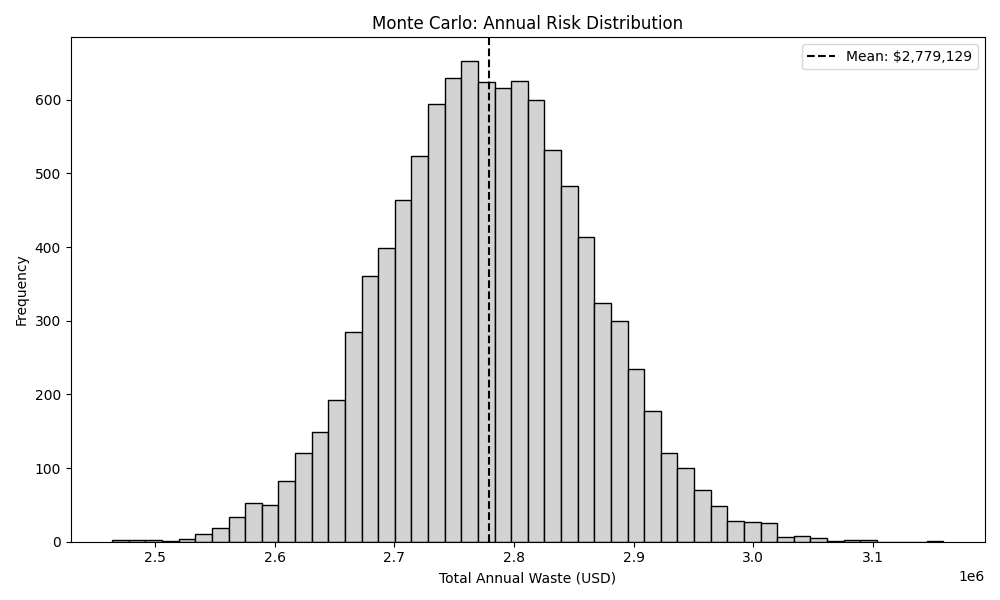

# Summary

While industry leaders report that 41% of new commercial code is AI-generated [@rocketdevs2026crisis], there is a significant quality issues that is emerging.  Recent studies also shows that 44% of AI initiatives are being rolled back due to operational costs [@applause2026quality]. 
Total development process has actually slowed by 19% as teams struggle to integrate "messy" AI logic [@rocketdevs2026crisis].

Current metrics which are used for tracking engineering productivity
lacks something very critical, the **Hidden cost of AI generated code**.
While companies are focused on the velocity and cost of utilizing token
by buying licenses from AI vendors, there is a complete lack of
visibility in **Review Tax**.

**Review Tax** is the massive amount of valuable and expensive senior
engineering time spent fixing, auditing and refactoring AI generated
code that might appear correct but are structurally fragile. Over time this leads to delays and significant waste of
capital. 

Recent research from UC Berkeley [@berkeley2026] showed that these benchmarks can be manipulated and do not reflect the real-world
performance.

**D**eterministic **I**ntegrity & **R**isk **A**ssessment **C**ore
**(DIRAC v1.0)** is a forensic framework designed to move beyond simple
dashboard and DORA metrics [@forsgren2018accelerate].

I have analysed over **2000** open source repositories with **10,005**
commits and quantified the **Information Entropy** of code changes to
map it directly to financial loss.

This paper shows that there is a need to **Audit Entropy** and protect
engineering decay over time.

# 1. Traditional Metrics in the AI Era

For years, framework like **Deployment Frequency, Lead Time**
(DORA)[@forsgren2018accelerate] has been the gold standard for velocity
metrics but never designed as a quality metrics. But in the era of AI,
it can be potentially be misleading. Here’s how

-   Multiple deployments can happen in a day but if each of them contain
    high-entropy code that requires extensive reviews by a senior, then
    velocity is an *illusion*.

-   DORA does not track Review Tax, it fails to show that a single AI
    generated commit could potentially consume significant senior team's capacity to ensure that system remains stable after merge.

-   Traditional metrics cannot see the **entropy** (disorder) inside a
    commit. A build will only have either a *pass* or *fail* status but

## 1.1 Moving Beyond Tokens

Most organisation would currently manage their AI costs via **Token
Utilization dashboard** provide by AI vendors. Additionally,
organization can have internal tracking to monitor input,
output token usage.

Yes, these can show how much an organisation is spending on the AI but it
never reveal how much the AI is costing *organizational engineering friction*.

Data driven decision making requires a forensic approach where **State
Transition Entropy** should to be measured.

It is also essential to understand the true impact on the organization's bottom line. This is where DIRAC is extremely helpful and provides visibility and governance.

## 1.2 Comparison of Governance Frameworks

To understand why DIRAC is necessary, we must compare it against the
metrics currently used by in software engineering.

While LOC and DORA measures **how much** and **how fast**,DIRAC measures
the **hidden cost** of the logic itself, specifically in the world where
AI is mainstream.

Table 1.2.1

+-----------+-----------+-----------+-----------+
| **Metric  | **Lines   | **DORA    | **DIRAC** |
| A         | of Code   | Metrics** |           |
| t         | (LoC)**   |           |           |
| tribute** |           |           |           |
+-----------+-----------+-----------+-----------+
| Primary   | V         | D         | A r c     |
| Focus     | olumetric | eployment | h         |
|           | Output    | Velocity  | itectural |
|           |           |           | Integrity |
+-----------+-----------+-----------+-----------+
| S         | High      | Low       | Very High |
| e         | (Size     | (Outcome  | (Logic    |
| nsitivity | only)     | only)     | Entropy)  |
+-----------+-----------+-----------+-----------+
| Financial | None      | Indirect  | Direct    |
| Mapping   |           | / Project | (Systemic |
|           |           | Based     | Friction) |
+-----------+-----------+-----------+-----------+
| AI        | N         | Limited   | Optimized |
| Context   | egligible |           | ( P r     |
|           |           |           | o         |
|           |           |           | bablistic |
|           |           |           | Audit)    |
+-----------+-----------+-----------+-----------+
| Risk      | Post      | Post      | Pre Merge |
| Detection | Commit    | D         | (Atomic)  |
|           |           | eployment |           |
+-----------+-----------+-----------+-----------+

# 2. Quantifying the drain

To effectively manage engineering friction, organizations must move to
deterministic units of measure.

This framework introduces two primary indicators:

1.  **Dirac Density Threshold (**$\Theta_D$) (@sec-ddt-spec)

2.  **Systemic Friction (**$S_f$) (@sec-sys-spec)

## 2.1 Dirac Density Threshold ($\Theta_D$) {#sec-ddt-spec}

**D**irac **D**ensity **T**hreshold (DDT) $\Theta_D$ is a governance
metric design to evaluate the intent behind any code change.

It measures relation between technical complexity of a **state
transition** and **contextal metadata** on an atomic commit.

In an AI augmented environment, code can be generated with zero
cognitive overhead. If this code is merged without human audit then the
$\Theta_D$ falls below the safe baseline.

Therefore by enforcing a minimum DDT, organizations can:

**A.** Identify Low-Intent Transitions by automatically flag commits
where **Entropy** to **Context ratio** is high and have high probability
that the AI generated codes aren’t verified.

**B.** Optimizing Engineering Capacity: To ensure that when a senior
engineer performs a review, they are auditing high-density,
well-documented logic than evaluating **noisy** probabilistic generated
code.

## 2.2 Mapping Entropy to Systemic Friction ($S_f$) {#sec-sys-spec}

Another core innovation of the DIRAC framework is the ability to assign
**financial value** to **Information Entropy (**$H_\Delta$).

This is only possible by analyzing the state transitions and subsequent
engineering overhead to maintain these transitions for calculating the
**Systemic Friction (**$S_f$).

Review Tax is the measurable impact of this friction which can be
calculated using the formula:

$$S_f = (\text{Review Time Cost}) + (\text{Remediation Cost})$$

Where:

-   **Diverted Engineering Capacity**: Is the cost of senior engineering
    time reassigned from new feature development to verifying and
    stabilizing high-entropy code.

-   **Structural Remediation** : Is the technical overhead required to
    address the code drift causing architectural delay before the code
    is transitioned to production environment.

By quantifying these frictions, the DIRAC framework allows the
organization to calculate the **True Cost of a Commit**.

Using this framework, organization can now see the direct correlation
between *high entropy AI generated code* and the *erosion of the
engineering budget* including *true productivity loss*.

## 2.3 Financial Mapping: Entropy vs Bottom Line

The table below illustrates how **DIRAC Risk Unit** (DRU) serves as an indicator of Systemic Friction $S_f$ and business impact.

By categorizing code transitions by their entropy levels, organization
can predict the **Review Tax** before it is actually paid.

## Table 2.3: Entropy vs. Financial Impact

This table provides  baseline for organizations to translate *technical entrop*y into *operational risks*.

+----------+----------+----------+------------+-------------------------+
| Entropy  | DRU      | Risk     | Potential  | Business Impact         |
| Level    |          | Category | Review Tax |                         |
+==========+==========+==========+============+=========================+
| 0.0 -    | \<0.5    | Low      | Minimal    | **High Feature          |
| 5.0      |          | (High    |            | Velocity:** Clean       |
|          |          | Intent)  |            | transitions, rapid      |
|          |          |          |            | delivery.               |
+----------+----------+----------+------------+-------------------------+
| 5.1 -    | 0.5 -    | Medium   | Moderate   | **Maintenance Mode:**   |
| 15.0     | 1.0      | (S       |            | Standard review         |
|          |          | tandard) |            | overhead required.      |
+----------+----------+----------+------------+-------------------------+
| 15.1+    | \>1.0    | E        | S          | **Structural Decay:**   |
|          |          | xtremely | ignificant | High probability of     |
|          |          | High     |            | rework.                 |
|          |          |          |            |                         |
|          |          | (**Black |            |                         |
|          |          | Swan     |            |                         |
|          |          | event**) |            |                         |
+----------+----------+----------+------------+-------------------------+

# Section 3. Risk Forecasting for the Enterprise

Traditional reporting structures often rely on linear growth models and
monthly averages to assess the health of software systems.

However, in an era of AI based development, these numbers can hide the
accumulation of potential risks and structural integrity in software
systems.

## 3.1 Visualizing Annual Exposure via Monte Carlo Simulations

Monthly averages provide a view of performance that can mask
high-entropy events.

A system may appear to be stable on a dashboard. While a single
high-entropy state transition can have a very high level of complexity ,
low contextual intent introducing code drifts.

This will consume engineering resources weeks or even months later, creating a **Black Swan** [@vasudevan2024blackswan] event.

In this framework, I have applied Monte Carlo simulations with over
10000 iterations **($n=10,000$ iterations)** to model annual budget
exposure.

{fig-align="center"}

Figure 3.1.1 illustrates the probability of **Black Swan** [@vasudevan2024blackswan] budget spikes. While most days can be stable, high-entropy events can drain weeks of engineering capacity in a single transition.

By simulating the distribution of **Dirac Risk Unit** (also represented as $\Upsilon_D$) across these cycles , the framework calculates 95% **V**alue **a**t **R**isk (**VaR**).

This forensic approach moved beyond static reporting and help software
companies to understand statistical probability of structural decay and
impact on long term stability of a system.

## 3.2 The Capacity Loss Ratio ($R_c$): Reclaiming Engineering Hours

The final strategic output of the DIRAC audit is the **Capacity Loss Ratio
($R_c$)**. 

This metric shows the specific percentage of total engineering
capacity that is absorbed by the Review Tax.  

It allows the organisation to visualize the **Effective Workforce** vs **Actual Workforce**.

Based on the forensic baseline of 2000 pen source repositories, the analysis
identifies an $R_c$ of **24.16%**. 

Let me try to put this in perspective for a global engineering profile:

* Baseline Salary: $150,000 USD 

* Annualized Review Tax $(150,000 \times R_c)$ = $36,240$ USD

* The Effective Capacity: Which means for every 50 engineers on payroll, the organization is receiving the effective output
of only \[50 \times (1 - 0.2416)\] $=$ **37.92** which is approximately **38** individuals.

The remaining capacity is not lost to laziness or lack of effort; it is the invisible tax representing diverted senior engineering efforts to stabilize high-entropy state transitions caused by AI code. 

DIRAC makes this visible so organization can implement **Automated Governance Gates** to lower this systemic friction **$R_c$** and reclaim the lost budget.

# Section 4. The DIRAC Governance Strategy

The objective of DIRAC framework is to help organization from passive observations to Deterministic Governance by leveraging forensic
indicators mentioned in the previous sections. 

This can help organization and leadership to implement **Automate gates** to protect the system’s integrity without impacting development velocity.

## 4.1 Implementing Automated Governance Gates

The primary mechanism for reclaiming engineering capacity can be the implementation of pre-merge Governance Gates.

Unlike traditional unit testing, which focus on syntax and execution, DIRAC gates focuses on Information Entropy ($H_\Delta$) and the Dirac Density Threshold ($\Theta_D$).

The governance protocol can operate on:

-   High-Intent Transitions with low Dirac Risk Unit (DRU) ($\Upsilon_D$): Changes that fall within
    the safe $\Theta_D$ baseline are fast-tracked. These transitions
    represent high-intent, well-documented logic that minimizes the
    *Review Tax*.

-   Incomprehensible Transitions with High Dirac Risk Unit DRU $\Upsilon_D$): Changes that
    exceed the risk threshold are automatically flagged for a mandatory *forensic audit*.

By filtering these transitions at the atomic level, organization can ensures that senior engineering capacity is only diverted to changes which has a high probability of structural impact. At the same time keep the entropy low and system stable.

## 4.2 Transitioning from "Pattern-Matching" to "Architected" Engineering

There is a widespread use of AI and the shift of software development is more towards **pattern matching** code. 

These code gets accepted because it could look familiar and it may not be architecturally sound. This is the one of the root cause of **Capacity Loss Ratio ($R_c$)**.

In DIRAC, the governance strategy enforces organization to make *Invisible Tax* visible. This framework incentivizes developers to provide the necessary contextual density for every AI assisted change.

This ensures that:

-   Human Intent remains the Primary Driver: AI is utilized as a tool, but the structural integrity is governed by deterministic
    human-verified thresholds.

-   Using frameworks to identify inefficient manual refactoring of high-risk modules, allowing the organizations to isolate and resolve only the high-entropy modules that pose a systemic risk.

# 5. Efficiency in AI Augmented Environments

Integration of Large Language Models (LLM) into the software lifecycle is an irreversible shift. This however, currently lacks transparency
regarding code entropy and stability of system and poses and significant risk to the long term stability in the software industry.

DIRAC framework provides the necessary forensic layer to manage this transition. 

By quantifying the Review Tax and identifying the Capacity Loss Ratio ($R_c$), organization can move beyond the *Illusion of velocity* and make data-driven decisions that protect their human capital.

The goal is not to limit the use of AI, but govern it and govern it well. By reclaiming the **24.16%** of lost capacity identified in this study,
organizations can ensure that their engineering teams remain focused on building the future, rather than remediating the structural decay of the past.

# 6. Automated Remediation: The Transition to Autonomous Governance

This section dives into the mitigating the structural delay identified in this research. 

In the next phase (version 2.0), the DIRAC framework will transition from detection to remediation by proposing Reinforcement Learning [@rl_foundation2024] Learning (RL). It will be designed to optimize the state transitions.

## 6.1 The Policy Objective

The objective of this remediation would be to design a dynamic optimization policy to minimize the Dirac Risk Unit ($\Upsilon_D$) while
maintaining engineering velocity. 

This layer learns organization's specific patterns to provide adaptive governance.

## 6.2 The Strategic Reward Function ($R$)

RL will utilizes a reward function to guide governance. The function penalizes high-entropy transitions and rewards contextual density
ensuring the system will always remains stable.

$$R = \text{Velocity} - (\omega_1 \cdot \Upsilon_D + \omega_2 \cdot H_\Delta)$$

$\omega_1, \omega_2$: Weighting coefficients calibrated to the
organization's specific risk $\Upsilon_D$: The real-time risk
unit of the proposed state transition.

By framing remediation as an optimization problem, DIRAC helps flagging
or rejection of atomic deltas that pose a threat to system stability.

# Section 7. Future version (v2.0): Moving from Structural Entropy to Semantic Fragility

While Version 1.0 of the DIRAC framework addresses Structural Entropy,
the next version of this research will focus on the deeper layer of
Semantic Fragility. 

The next version involves tracking how logic shifts
over time based on historical entropy over time due to AI assisted code.

This will help in analysing long term trajectory of $\Upsilon_D$, DIRAC
can move towards predictive failure modelling. 

The goal is to provide
leadership, the ability of predict the system failure based on
historical entropy trends before atomic commits are made to the systems.
