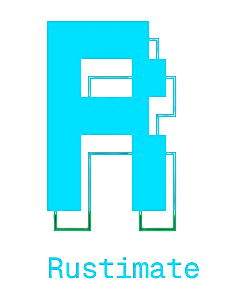

{fig-align="center"}

 

## Introduction

Rustimate is a programmable engine for visual technical story telling. It lets you write scripts and render explanations.

It is designed for:

-   **Technical bloggers**
-   **Educators**
-   **Researchers**
-   **Documentation writers**

## How it works

Rustimate uses a domain-specific language called **RSL** (Rustimate Studio Language) to describe scenes. It's engine renders these instructions into visual frames and export to `mp4`.

You just write a `.rsl` file and Rustimate takes care of the rendering

## Features

This version **`v0.1.0`** has following features.

-   Cross-platform support which includes Mac, Linux and Windows
-   CLI based workflow
-   Fully functional Community Edition
-   Export to 4K format for Pro users
-   Your data stays locally
-   Editor tooling available through **`Tree-Sitter`** & **`Language Server Protocol (LSP)`**

<!-- ::: {.media-placeholder} -->

<!-- 📽️ **[PLACEHOLDER — Overview / hero animation or product demo video]**   -->

<!-- *Replace with: `` or ``* -->

<!-- 📽️ ** Overview / hero animation or product demo video]** -->

<!-- ::: -->

{fig-align="center"}

# Rustimate Guide

**Rustimate Guide** is a structured narrative format that tightly integrates:

- RSL scripts
- Rendered visualizations
- Explanatory prose

It allows authors to publish visual technical tutorials where animations and explanations live side by side.

::: {.callout-tip}
## Quarto Markdown support — coming soon
Native Quarto & Markdown rendering support is on the Rustimate roadmap.
:::

## Next steps

-   [Install Rustimate →](installation.qmd)
-   [5-minute Quickstart →](quickstart.qmd)
-   [RSL Language Reference →](rsl-reference.qmd)
